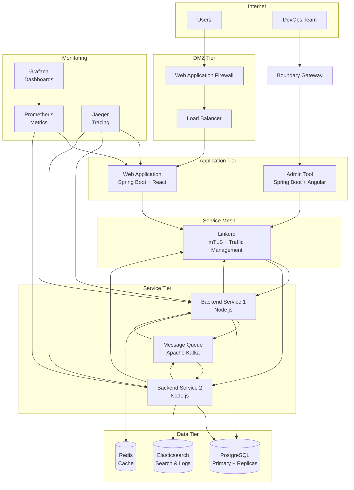
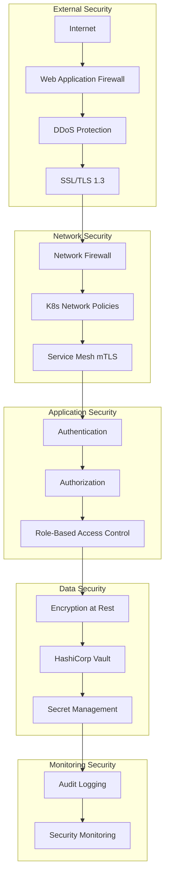
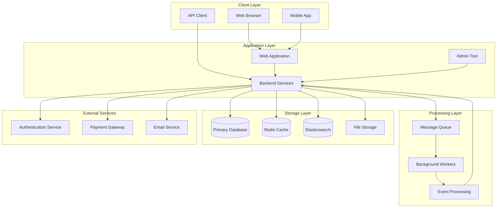
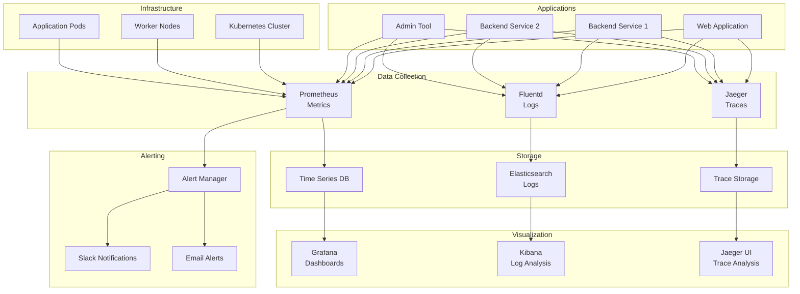
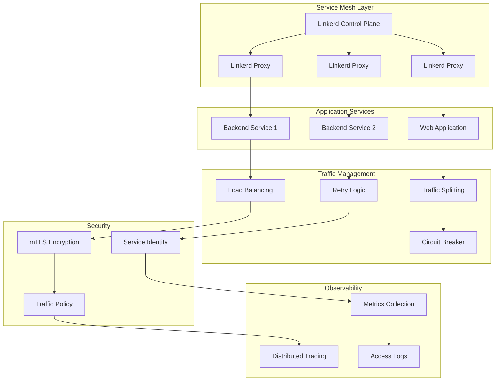
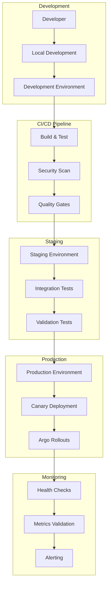
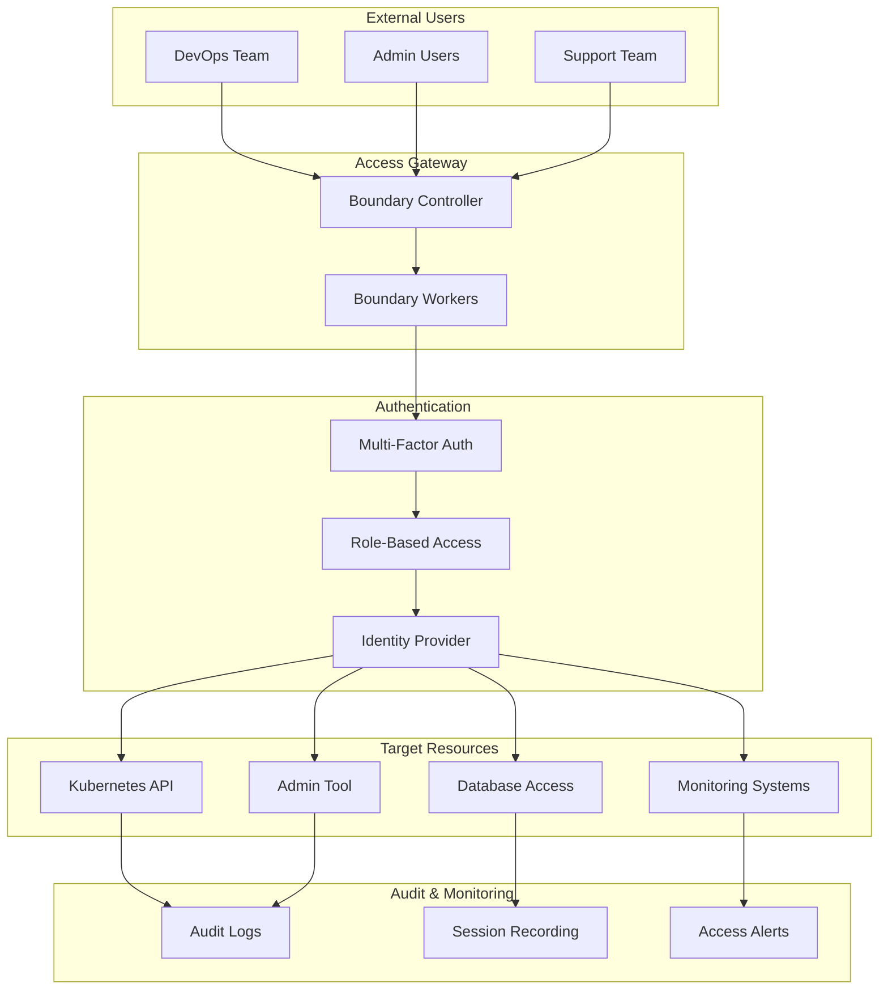
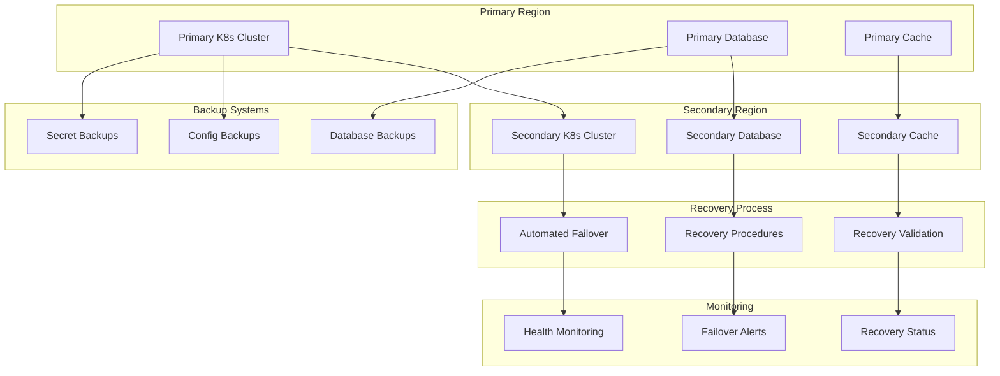

# Architecture Diagrams

This document contains visual representations of the 8am infrastructure design using Mermaid diagrams.

## High-Level Architecture



## Network Architecture

```mermaid
graph TB
    subgraph "Internet"
        Internet[Internet Traffic]
    end
    
    subgraph "DMZ Network"
        WAF[WAF]
        SSL[SSL Termination]
        DDoS[DDoS Protection]
    end
    
    subgraph "Application Network"
        LB[Load Balancer]
        WebApp[Web Application]
        Admin[Admin Tool]
    end
    
    subgraph "Service Network"
        BS1[Backend Service 1]
        BS2[Backend Service 2]
        MQ[Message Queue]
    end
    
    subgraph "Data Network"
        DB[(Database)]
        Cache[(Cache)]
        Search[(Search)]
    end
    
    subgraph "Management Network"
        Boundary[Boundary Gateway]
        Bastion[Bastion Host]
        Monitoring[Monitoring]
    end
    
    Internet --> WAF
    DevOps --> Boundary
    Boundary --> Workers
    Bastion --> Admin
    Bastion --> InternalAPI
    
    WAF --> SSL
    SSL --> LB
    
    LB --> WebApp
    LB --> Admin
    
    WebApp --> BS1
    WebApp --> BS2
    BS1 --> MQ
    BS2 --> MQ
    MQ --> BS1
    MQ --> BS2
    
    BS1 --> DB
    BS1 --> Cache
    BS2 --> DB
    BS2 --> Search
```

## Security Architecture



## CI/CD Pipeline Flow

```mermaid
graph LR
    subgraph "Source Control"
        Dev[Developer]
        Git[Git Repository]
        PR[Pull Request]
    end
    
    subgraph "CI Pipeline"
        Build[Build & Test]
        Security[Security Scan]
        Quality[Quality Gates]
    end
    
    subgraph "CD Pipeline"
        Staging[Deploy to Staging]
        Validation[Validation Tests]
        Production[Deploy to Production]
    end
    
    subgraph "Deployment Strategy"
        Canary[Canary Deployment]
        Rollout[Argo Rollouts]
        Monitor[Monitor & Validate]
    end
    
    Dev --> Git
    Git --> PR
    PR --> Build
    Build --> Security
    Security --> Quality
    Quality --> Staging
    Staging --> Validation
    Validation --> Production
    Production --> Canary
    Canary --> Rollout
    Rollout --> Monitor
```



## Data Flow Architecture



## Monitoring and Observability



## Service Mesh Architecture



## Deployment Architecture



## Access Management Architecture



## Disaster Recovery Architecture

